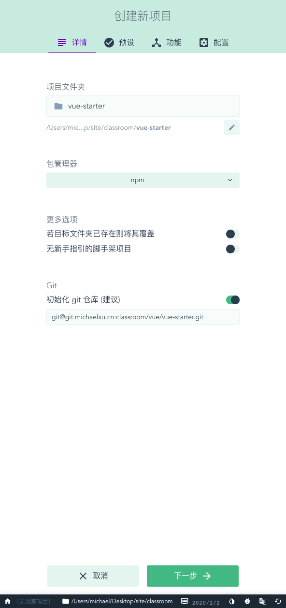
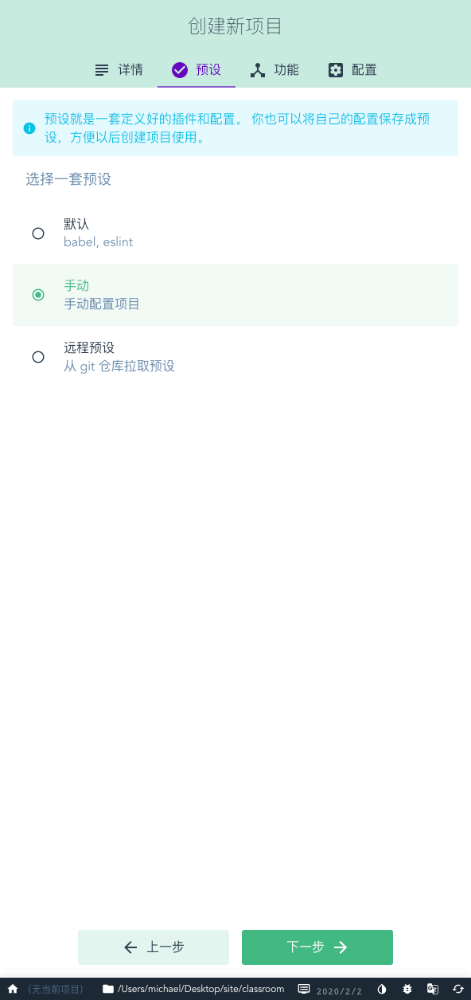
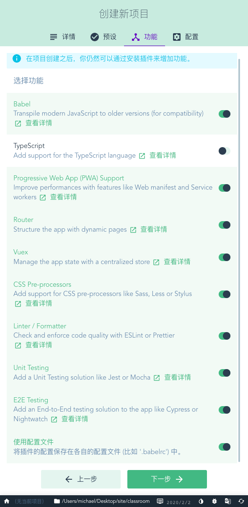
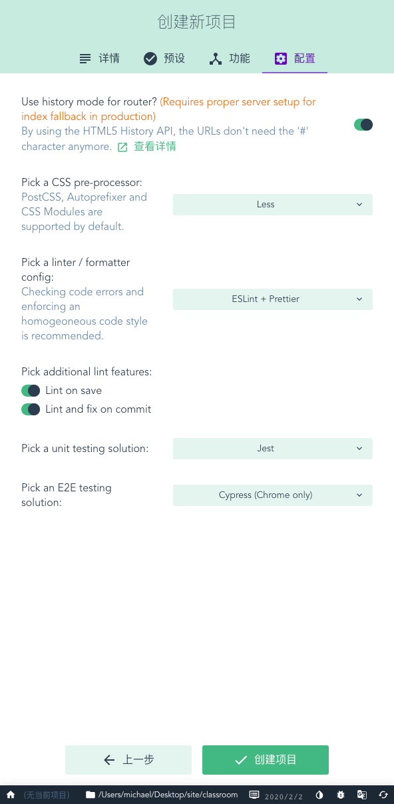
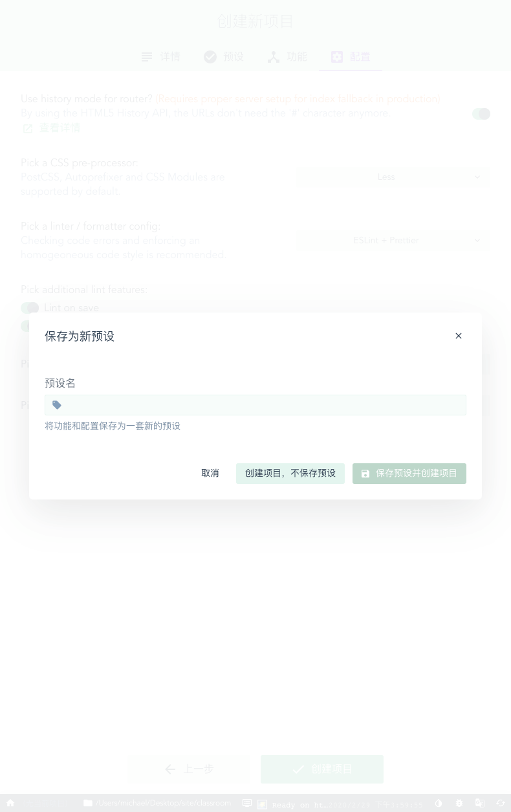
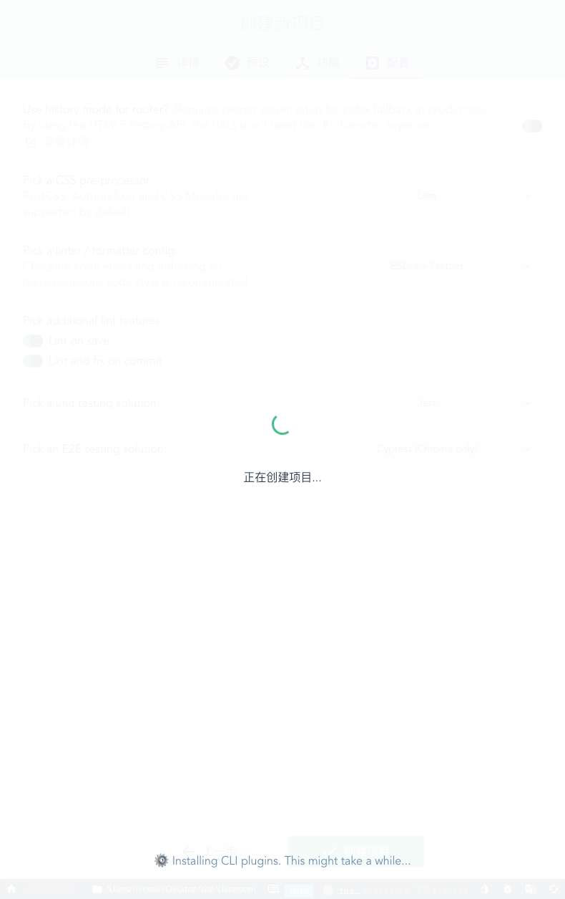
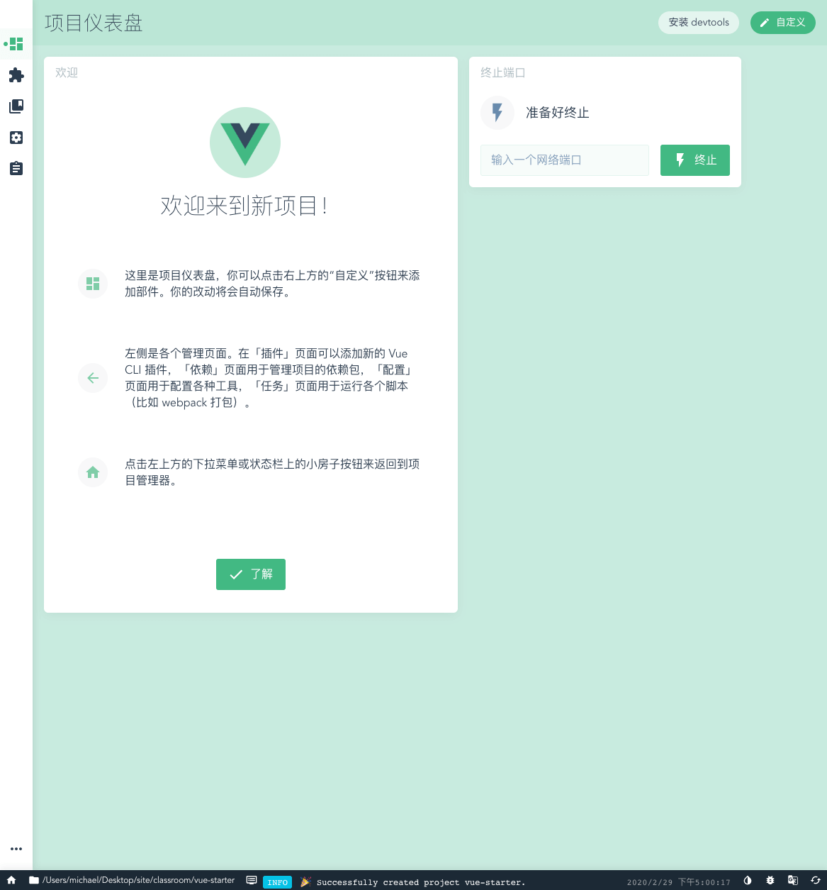
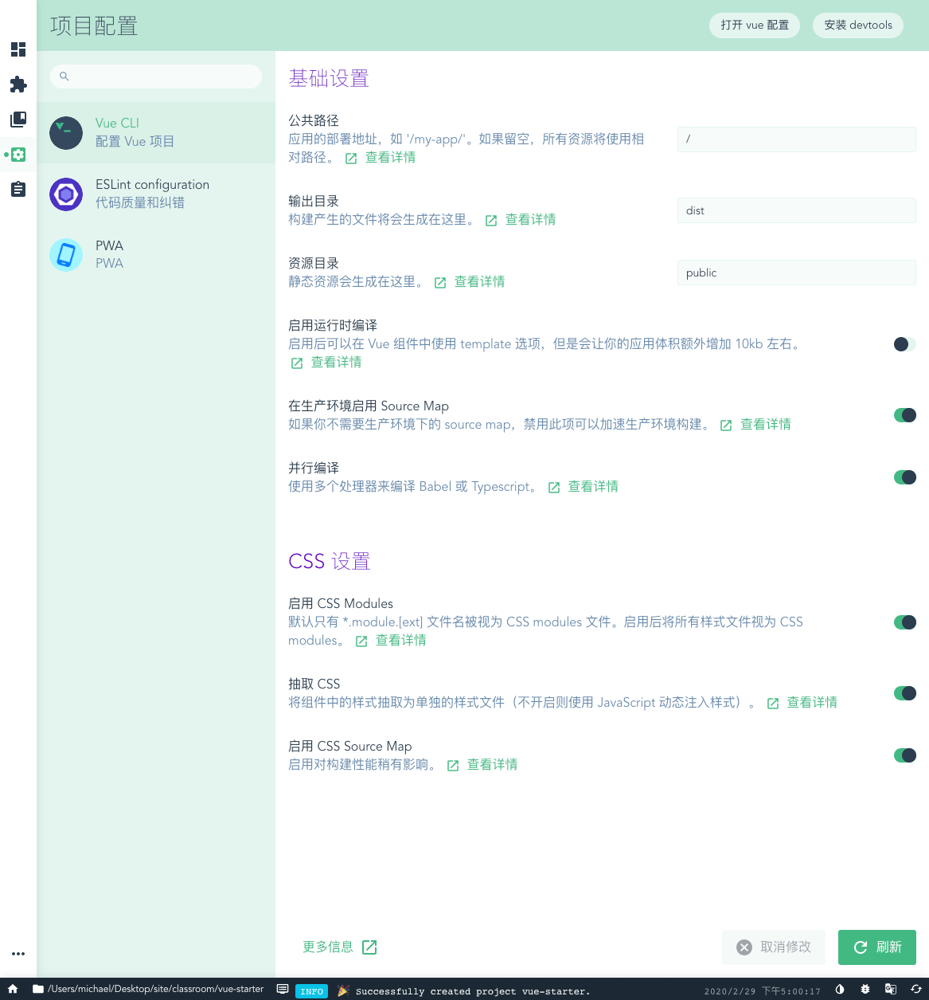
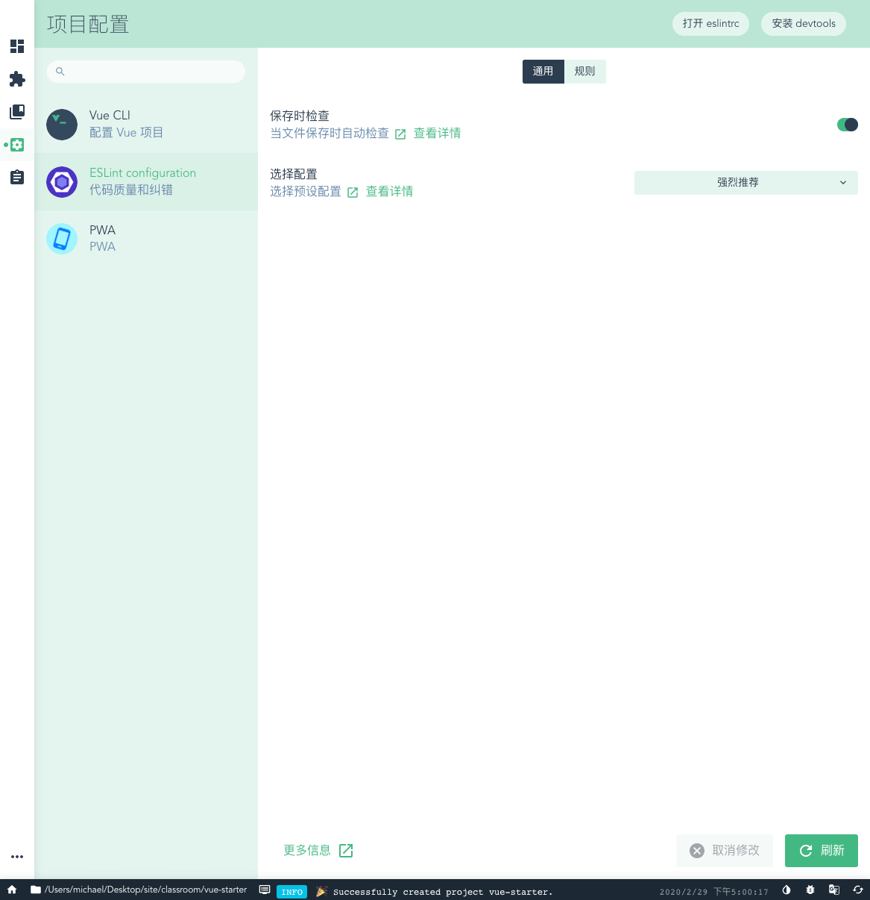
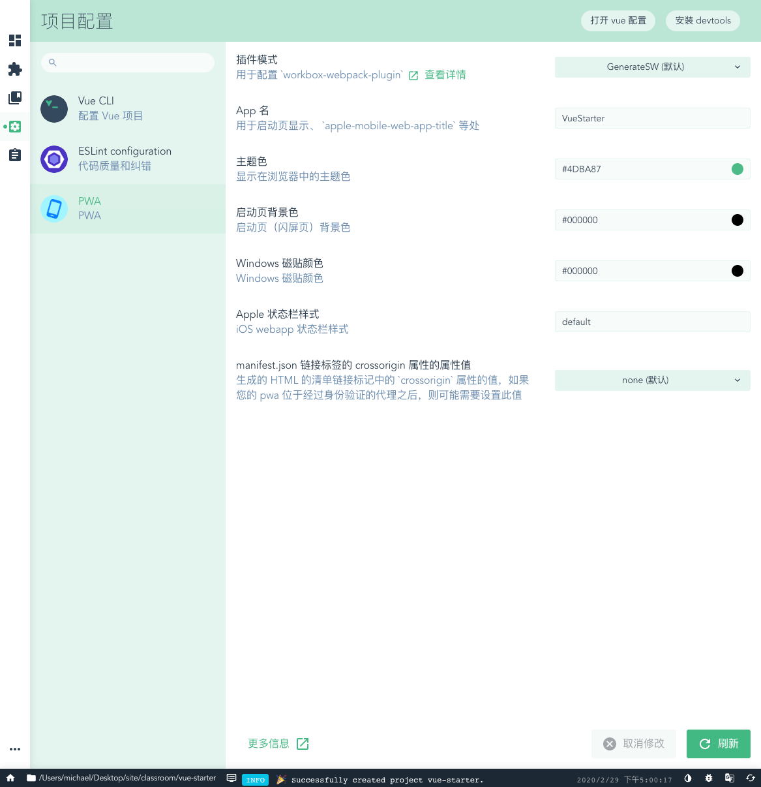

# Vue 入门脚手架

## 目录简介

1. [介绍](#介绍)
2. [开发环境搭建](#开发环境搭建)
   - [安装 nvm](#安装nvm)
   - [安装 node.js](#安装node.js)
   - [安装 nrm](#安装nrm)
   - [安装 yarn](#安装yarn)
   - [安装代码编辑器](#安装代码编辑器)
   - [安装 vue 命令行工具](#安装vue命令行工具)
3. [项目环境搭建](#项目环境搭建)
   - [初始化项目](#初始化项目)
   - [自定义配置](#自定义配置)
   - [新增常用实践目录](#新增常用实践目录)
   - [初始化全局样式](#初始化全局样式)
   - [编写异常组件](#编写异常组件)
   - [封装 HTTP 请求](#封装HTTP请求)
   - [UI 组件库选型](#UI组件库选型)
   - [安装 Vant UI](#安装VantUI)
   - [编写登录组件](#编写登录组件)
   - [编写权限组件](#编写权限组件)
   - [其他处理](#其他处理)
4. [开发与构建命令](#开发与构建命令)
   - [依赖配置](#依赖配置)
   - [命令说明](#命令说明)
5. [开发流程](#开发流程)
   - [概述](#概述)
   - [载入组件](#载入组件)
   - [设置路由](#设置路由)
   - [设置菜单](#设置菜单)
   - [配置测试接口](#配置测试接口)
   - [创建 http 请求](#创建http请求)
   - [调用 http 请求](#调用http请求)
   - [使用 vuex(可选)](#使用vuex)
     - [触发 action](#触发action)
     - [创建 store](#创建store)
     - [定义 sotre 计算属性](#定义sotre计算属性)
     - [创建 modules](#创建modules)
   - [发布](#发布)

## <a name="介绍">介绍</a>

本项目是基于 ES2015+ & @vue/cli(v4.2.3) & webpack(v4) & vuex(v3.1.2) & vue-router(v3.1.6) & ESLint(recommended) & Less(v3.11.1) & Jest & Cypress 按照官方文档，遵循目前项目经验的常用实践，搭建的入门脚手架，不定期迭代新功能。大家可以直接克隆使用，也可以按照搭建方法一步一步自己搭建。

## <a name="开发环境搭建">开发环境搭建</a>

### <a name="安装nvm">安装 nvm</a>

node.js 版本管理工具，最新版本号请到 https://github.com/nvm-sh/nvm 查看

```bash
curl -o- https://raw.githubusercontent.com/nvm-sh/nvm/v0.34.0/install.sh | bash
```

### <a name="安装node.js">安装 node.js</a>

其他版本号，请查看 https://nodejs.org/zh-cn/download/releases/

```bash
nvm install 8.16.0
```

### <a name="安装nrm">安装 nrm</a>

npm 源管理工具，可以帮助你轻松、快速地在不同的 npm 源之间进行切换

```bash
# 安装 nrm
npm install -g nrm

# 列出 npm 源列表
nrm ls

# 默认为国外源，这里切换为淘宝源，加快包下载速度
nrm use taobao
```

### <a name="安装yarn">安装 yarn</a>

yarn 是 Facebook 提供的替代 npm 的工具，可以加速 node 模块的下载

```bash
# 安装 yarn
npm install -g yarn

# 默认为国外源，修改为淘宝源
yarn config set registry https://registry.npm.taobao.org --global
yarn config set disturl https://npm.taobao.org/dist --global
```

### <a name="安装代码编辑器">安装代码编辑器</a>

手动搜索 Visual Studio Code 下载并安装，并在编辑器内装上以下插件：

- Vetur —— 语法高亮、智能感知、Emmet 等
- Auto Close Tag：自动闭合标签
- Auto Rename Tag：自动重命名标签，配合上面的插件使用
- Path Intellisense：文件路径提示补全

### <a name="安装vue命令行工具">安装 vue 命令行工具</a>

Vue CLI 需要 Node.js 8.9 或更高版本 (推荐 8.11.0+)，可以使用 nvm 或 nvm-windows 在同一台电脑中管理多个 Node 版本

```bash
npm install -g @vue/cli
```

## <a name="项目环境搭建">项目环境搭建</a>

### <a name="初始化项目">初始化项目</a>

Vue CLI 4 可以通过图形化界面初始化项目，并安装 Babel、PWA、Router、Vuex、Less、Linter、Jest、Cypress 等插件，相对命令行更加便捷和高效，命令如下：

```bash
vue create vue-starter  // 生成一个名为 vue-starter 的项目
cd vue-starter          // 进入 vue-starter 项目根目录
vue ui                  // 启动图形化配置界面
```

以下为我的图形化配置界面的配置：

<center class="half">





  
</center>
<br />
<center class="half">





</center>

### <a name="自定义配置">自定义配置</a>

虽然使用 `vue ui` 可以进行可视化配置，但在实际开发中，肯定有需要自定义配置的部分，可以参考[全局 CLI 配置](https://cli.vuejs.org/config/#global-cli-config)，本工程配置见 [`vue.config.js`](/vue.config.js)。

配置好了之后，可以通过命令输出查看一下，如下：

```bash
# 参考：https://cli.vuejs.org/guide/webpack.html#inspecting-the-project-s-webpack-config

# 将配置输出到 output.js 文件
vue inspect > output.js

# 只审查第一条规则
vue inspect module.rules.0

# 列出所有规则和插件的名字
vue inspect --rules
[
  'vue',
  'images',
  'svg',
  'media',
  'fonts',
  'pug',
  'css',
  'postcss',
  'scss',
  'sass',
  'less',
  'stylus',
  'js',
  'eslint'
]

vue inspect --plugins
[
  'vue-loader',
  'define',
  'case-sensitive-paths',
  'friendly-errors',
  'html',
  'pwa',
  'preload',
  'prefetch',
  'cors',
  'copy'
]
```

### <a name="新增常用实践目录">新增常用实践目录</a>

```bash
|── dist                                    # 部署目录
|── .github                                 # github 维护规范
|── docs                                    # 相关文档
|── public                                  # 静态资源目录，只部署不打包
├── src                                     # 源代码
│   ├── api                                 # 所有 HTTP 请求
│   │   ├── login.js                        # 首页（根据业务模块命名，和 /views/* 一一对应）
│   ├── assets                              # 图片样式等静态资源，会打包
│   ├── components                          # 业务通用组件
│   ├── router                              # 路由
│   │   ├── index.js                        # 路由入口
│   ├── utils                               # 工具库
│   │   ├── authority.js                         # 操作 token
│   │   ├── index.js                        # 工具方法
│   │   ├── request.js                      # 全局 http 请求方法封装
│   ├── views                               # 页面视图
│   │   ├── exception                       # 异常
│   │   │   ├── 403.vue                     # 403
│   │   │   ├── 404.vue                     # 404
│   │   │   ├── 500.vue                     # 500
│   │   │   ├── comming.vue                 # 敬请期待
│   │   ├── home                            # 响应路由切换的 vue 组件（根据业务模块命名，和 /api/* 一一对应）
│   │   │   ├── About.vue                   # 关于我们
│   │   │   ├── index.vue                   # 首页
│   │   │   ├── service.js                  # 业务逻辑
│   ├── App.vue                             # Vue 模板入口
│   ├── main.js                             # Vue 入口 JS
│   ├── registerServiceWorker.js            # PWA配置（离线缓存、消息推送、后台自动更新等任务）
├── tests                                   # 测试工具
├── .browserslistrc                         # 项目的目标浏览器范围配置
├── .eslintrc.js                            # ESLint 配置
├── .gitignore                              # git 提交时需要忽略的文件配置
├── babel.config.js                         # babel-loader 配置
├── cypress.json                            # cypress 配置
├── jest.config.js                          # jest 配置
├── package-lock.json                       # 包快照（锁定包及其依赖包版本号，建议提交）
├── package.json                            # 包配置
├── README.md                               # 项目自述
└── vue.config.js                           # vue-cli 配置
```

### <a name="初始化全局样式">初始化全局样式</a>

```bash
# 安装 Sass 预处理器
npm install -D sass-loader node-sass

# 创建自定义全局样式文件
vim src/global.scss  // 新建完成后，请参见配置：https://cli.vuejs.org/guide/css.html#referencing-assets

# 保持不同浏览器默认样式一致
npm install -S @csstools/normalize.css  // 安装完成后 `@import '~@csstools/normalize.css';` in `src/global.scss`
```

### <a name="编写异常组件">编写异常组件</a>

1.定义异常类型 [`/src/components/Exception/type.js`](/src/components/Exception/type.js)

```js
const types = {
  403: {
    img: "https://gw.alipayobjects.com/zos/rmsportal/wZcnGqRDyhPOEYFcZDnb.svg",
    title: "403",
    desc: "抱歉，你无权访问该页面"
  },
  404: {
    img: "https://gw.alipayobjects.com/zos/rmsportal/KpnpchXsobRgLElEozzI.svg",
    title: "404",
    desc: "抱歉，你访问的页面不存在"
  },
  500: {
    img: "https://gw.alipayobjects.com/zos/rmsportal/RVRUAYdCGeYNBWoKiIwB.svg",
    title: "500",
    desc: "抱歉，服务器出错了"
  },
  comming: {
    img: "https://gw.alipayobjects.com/zos/rmsportal/KpnpchXsobRgLElEozzI.svg",
    title: "敬请期待",
    desc: "即将上线"
  }
};

export default types;
```

2.新建异常子组件 [`/src/components/Exception/ExceptionPage.vue`](/src/components/Exception/ExceptionPage.vue)

```vue
<template>
  <div class="exception">
    <div class="imgBlock">
      <div
        class="imgEle"
        :style="{ backgroundImage: `url(${config[type].img})` }"
      ></div>
    </div>
    <div class="content">
      <h1>{{ config[type].title }}</h1>
      <div class="desc">{{ config[type].desc }}</div>
      <div class="actions">
        <a href="javascript:;" @click="handleToHome">返回首页</a>
      </div>
    </div>
  </div>
</template>
<script>
import types from "./type";

export default {
  name: "Exception",
  props: {
    type: {
      type: String,
      default: "404"
    }
  },
  data() {
    return {
      config: types
    };
  },
  methods: {
    handleToHome() {
      this.$router.push("/");
    }
  }
};
</script>
...
```

3.导出异常子组件 [`/src/components/Exception/index.js`](/src/components/Exception/index.js)

```js
import ExceptionPage from "./ExceptionPage.vue";
export default ExceptionPage;
```

4.编写异常页面 [`/src/views/exception/403.vue`](/src/views/exception/403.vue) ，其他 404、500 等类似

```vue
<template>
  <exception-page type="403" />
</template>

<script>
import ExceptionPage from "@/components/Exception/";

export default {
  components: {
    ExceptionPage
  }
};
</script>
```

5.定义异常页面路由 [`/src/router/index.js`](/src/router/index.js)

```js
const routes = [
  ...
  {
    path: "/exception/403",
    name: "Exception403",
    component: () => import("../views/exception/403"),
    meta: { title: "403", permission: ["exception"] }
  },
  {
    path: "/exception/404",
    name: "Exception404",
    component: () =>
      import(/* webpackChunkName: "fail" */ "../views/exception/404"),
    meta: { title: "404", permission: ["exception"] }
  },
  {
    path: "/exception/500",
    name: "Exception500",
    component: () =>
      import(/* webpackChunkName: "fail" */ "../views/exception/500"),
    meta: { title: "500", permission: ["exception"] }
  },
  {
    path: "/comming",
    name: "Comming",
    component: () =>
      import(/* webpackChunkName: "fail" */ "../views/exception/comming"),
    meta: { title: "comming", permission: ["exception"] }
  }
];
...
```

#### <a name="封装HTTP请求">封装 HTTP 请求</a>

1.安装相关插件

```bash
npm i -S js-cookie  // 用于处理 cookie 的简单轻量级库
npm i -S axios      // 基于 promise 的 HTTP 库，可以用在浏览器和 node.js 中
```

2.定义权限操作方法 [`/src/utils/authority.js`](/src/utils/authority.js)

```js
import Cookies from "js-cookie";

const expiresTime = new Date(new Date().getTime() + 1440 * 60 * 1000);

export function getAuthority() {
  return Cookies.get("authority") || "admin";
}

export function setAuthority(authority) {
  return Cookies.set("authority", authority, { expires: expiresTime });
}

export function removeAuthority(authority) {
  return Cookies.remove("authority", authority);
}
```

3.封装 HTTP 请求 [`/src/utils/request.js`](/src/utils/request.js)

```js
...
// 创建 axios 实例
const service = axios.create({
  baseURL: process.env.BASE_API, // api 的 base_url
  timeout: 5000, // 请求超时时间
  withCredentials: true // 跨域请求携带凭据
});
// request 请求拦截（可以改变 url 或 options）
service.interceptors.request.use(
  config => {
    // 需要在请求之前，执行的方法放这里
    return config;
  },
  error => {
    // 此处可以捕获请求出错时，做自定义统一处理
    console.log(error); // for debug
    Promise.reject(error);
  }
);
...
// respone 响应拦截
service.interceptors.response.use(
  /**
   * 如果此处不想做任何响应后的处理，就直接返回 response => response
   */
  response => response,

  /**
   * 此处可以对服务端返回，做自定义统一处理
   */
  // response => {
  //   const res = response.data;

  //   if (res.code === 401.1) {
  //     console.error(codeMessage[res.code]);
  //     store.dispatch("user/logout").then(() => {
  //       setTimeout(() => {
  //         window.location.reload();
  //       }, 1500);
  //     });
  //     return Promise.reject(new Error(res.message || "Error"));
  //   } else {
  //     return res;
  //   }
  // },

  /**
   * 此处可以捕获 HTTP 错误，做自定义统一处理
   */
  error => {
    if (error.response) {
      const status = error.response.status;
      if (status === 401) {
        console.error(codeMessage[status]);
        window.location.href = "/exception/403";
      }
      if (status === 403) {
        console.error(codeMessage[status]);
        window.location.href = "/exception/403";
      }
      if (status <= 504 && status >= 500) {
        console.error(codeMessage[status]);
        window.location.href = "/exception/500";
      }
      if (status >= 404 && status < 422) {
        console.error(codeMessage[status]);
        window.location.href = "/exception/404";
      }
    }
    return Promise.reject(error);
  }
);
```

#### <a name="UI组件库选型">UI 组件库选型</a>

**需求**  
大厂，持续更新，覆盖大部分常用组件，社区活跃，移动端，License 尽量自由

**搜索**  
[github#awesome-vue#mobile](https://github.com/vuejs/awesome-vue#mobile)

- mint-ui - Mobile UI elements for Vue.js.
- vant - A Vue.js 2.0 Mobile UI From YouZan.
- cube-ui - A fantastic mobile ui lib implement by Vue.js 2.
- mand-mobile - A mobile UI toolkit, based on Vue.js 2, designed for financial scenes.
- NutUI - A Vue.js 2.0 UI Toolkit for Mobile Web

**对比**  
| | vant | mand-mobile | mint-ui | NutUI |
| --- | --- | --- | --- | --- |
| 厂家 | 有赞 | 滴滴 | 饿了么 | 京东 |
| 行业 | 电商 | 金融 | 新零售 | 电商 |
| Commits | 5,020 | 1,401 | 304 | 945 |
| Branches | 7 | 6 | 3 | 6 |
| Releases | 303 | 66 | 49 | 31 |
| Contributors | 113 | 22 | 34 | 16 |
| LICENSE | MIT | Apache License 2.0 | MIT | MIT |

**结论**  
最终我选择 “有赞” 出品的 “vant”，理由是覆盖了大部分常用组件，社区最活跃，License 很自由

#### <a name="安装VantUI">安装 Vant UI</a>

1.通过 npm 安装

```shell
npm i vant -S
```

2.配置按需引入组件
**安装插件**

```shell
npm i babel-plugin-import -D
```

**自动按需引入组件**  
编辑 [`/src/babel.config.js`](/src/babel.config.js)

```js
module.exports = {
  ...
  plugins: [
    ['import', {
      libraryName: 'vant',
      libraryDirectory: 'es',
      style: true
    }, 'vant']
  ]
};
```

3.开始使用

```vue
<template>
  ...
  <van-button type="info" @tap="bindLogin">登录</van-button>
  ...
</template>
<script>
import { Button } from "vant";
export default {
  components: {
    [Button.name]: Button
  }
};
</script>
```

4.Rem 适配
**安装插件**

```shell
npm i postcss-pxtorem -D
```

**配置插件**  
> 应避免 IDE ignore node_modules 目录，否则将导致 Vant 样式无法被编译
编辑 [`/src/vue.config.js`](/src/vue.config.js)

```js
const autoprefixer = require("autoprefixer");
const pxtorem = require("postcss-pxtorem");
...
module.exports = {
  ...
    css: {
        loaderOptions: {
            postcss: {
                    // 这里的选项会传递给 postcss-loader
                    plugins: [
                      autoprefixer(),
                      pxtorem({
                        rootValue: 18,
                        propList: ["*"]
                      })
                    ]
                  }
        }
    }
  ...  
}
...
```
5.自定义主题
**按需引入样式源文件**  
> 在 babel.config.js 中配置按需引入样式源文件，注意 babel6 不支持按需引入样式，请手动引入样式
```js
module.exports = {
  plugins: [
    [
      'import',
      {
        libraryName: 'vant',
        libraryDirectory: 'es',
        // 指定样式路径
        style: name => `${name}/style/less`
      },
      'vant'
    ]
  ]
};
```  

**新建主题样式文件**  
编辑 [`/src/theme.less`](/src/theme.less)
```shell
# 直接复制官方主题文件，再根据设计修改
cp https://github.com/youzan/vant/blob/dev/src/style/var.less /src/theme.less
```  

**修改样式变量**  
编辑 [`/vue.config.js`](/vue.config.js)
```js
// vue.config.js
const path = require("path");
const resolve = dir => path.join(__dirname, dir);
...
module.exports = {
  css: {
    loaderOptions: {
      less: {
        modifyVars: {
          // 直接覆盖变量
          'text-color': '#111',
          'border-color': '#eee',
          // 或者可以通过 less 文件覆盖（文件路径为绝对路径）
          hack: `true; @import "${resolve("/src/theme.less")}";`
        },
      },
    },
  },
};
...
```  
## 未完待续...
