# Vue 入门脚手架

## 目录简介

1. [介绍](#介绍)
2. [开发环境搭建](#开发环境搭建)
   - [安装nvm](#安装nvm)
   - [安装node.js](#安装node.js)
   - [安装nrm](#安装nrm)
   - [安装yarn](#安装yarn)
   - [安装代码编辑器](#安装代码编辑器)
   - [安装vue命令行工具](#安装vue命令行工具)
3. [项目环境搭建](#项目环境搭建)
   - [初始化项目](#初始化项目)
   - [自定义配置](#自定义配置)
   - [新增常用实践目录](#新增常用实践目录)
   - [封装HTTP请求](#封装HTTP请求)
   - [编写公共组件](#编写公共组件)
   - [编写权限组件](#编写权限组件)
   - [其他处理](#其他处理)
4. [开发与构建命令](#开发与构建命令)
   - [依赖配置](#依赖配置)
   - [命令说明](#命令说明)
5. [程序目录](#程序目录)
6. [开发流程](#开发流程)  
   - [概述](#概述)
   - [载入组件](#载入组件)
   - [设置路由](#设置路由)
   - [设置菜单](#设置菜单)
   - [配置测试接口](#配置测试接口)
   - [创建 http 请求](#创建http请求)
   - [调用 http 请求](#调用http请求)
   - [使用 vuex(可选)](#使用vuex)
     - [触发 action](#触发action)
     - [创建 store](#创建store)
     - [定义 sotre 计算属性](#定义sotre计算属性)
     - [创建 modules](#创建modules)
   - [发布](#发布)

## <a name="介绍">介绍</a>

本项目是基于 @vue/cli(v4.2.3) & webpack(v4) & vuex(v3.1.2) & vue-router(v3.1.6) & ESLint(recommended) & Less(v3.11.1) & Jest & Cypress 按照官方文档，遵循目前项目经验的常用实践，搭建的入门脚手架，不定期迭代新功能。大家可以直接克隆使用，也可以按照搭建方法一步一步自己搭建。

## <a name="开发环境搭建">开发环境搭建</a>

### <a name="开发环境搭建">开发环境搭建</a>

#### <a name="安装nvm">安装nvm</a>  
node.js 版本管理工具，最新版本号请到 https://github.com/nvm-sh/nvm 查看

```bash
curl -o- https://raw.githubusercontent.com/nvm-sh/nvm/v0.34.0/install.sh | bash
```

#### <a name="安装node.js">安装node.js</a>   
其他版本号，请查看 https://nodejs.org/zh-cn/download/releases/

```bash
nvm install 8.16.0
```

#### <a name="安装nrm">安装nrm</a>   
npm 源管理工具，可以帮助你轻松、快速地在不同的 npm 源之间进行切换

```bash
# 安装 nrm
npm install -g nrm

# 列出 npm 源列表
nrm ls

# 默认为国外源，这里切换为淘宝源，加快包下载速度
nrm use taobao
```

#### <a name="安装yarn">安装yarn</a>   
yarn 是 Facebook 提供的替代 npm 的工具，可以加速 node 模块的下载

```bash
# 安装 yarn
npm install -g yarn

# 默认为国外源，修改为淘宝源
yarn config set registry https://registry.npm.taobao.org --global
yarn config set disturl https://npm.taobao.org/dist --global
```

#### <a name="安装代码编辑器">安装代码编辑器</a>   
手动搜索 Visual Studio Code 下载并安装，并在编辑器内装上以下插件：

- Vetur —— 语法高亮、智能感知、Emmet 等
- Auto Close Tag：自动闭合标签
- Auto Rename Tag：自动重命名标签，配合上面的插件使用
- Path Intellisense：文件路径提示补全

#### <a name="安装vue命令行工具">安装vue命令行工具</a>   
Vue CLI 需要 Node.js 8.9 或更高版本 (推荐 8.11.0+)，可以使用 nvm 或 nvm-windows 在同一台电脑中管理多个 Node 版本

```bash
npm install -g @vue/cli
```

## <a name="项目环境搭建">项目环境搭建</a>  

#### <a name="初始化项目">初始化项目</a>   
```bash
# 通过图形化界面初始化项目，安装 Babel、PWA、Router、Vuex、Less、Linter、Jest、Cypress，相对命令行更加便捷和高效
vue ui
```  
<center class="half">
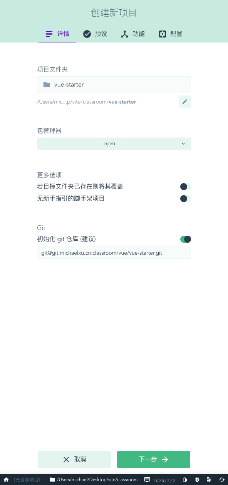
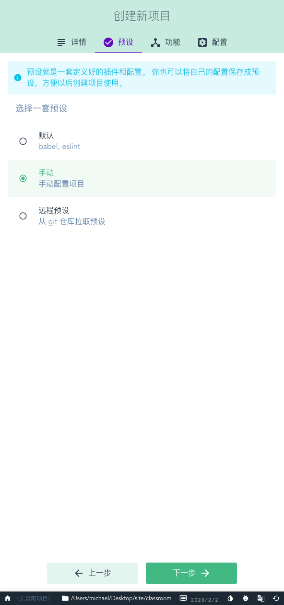
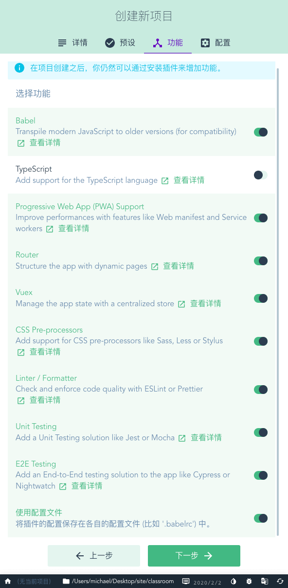
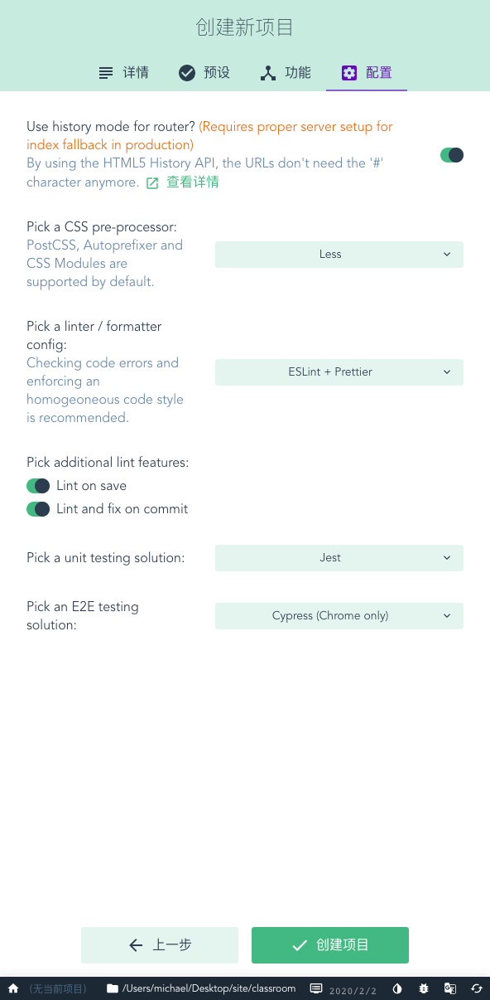
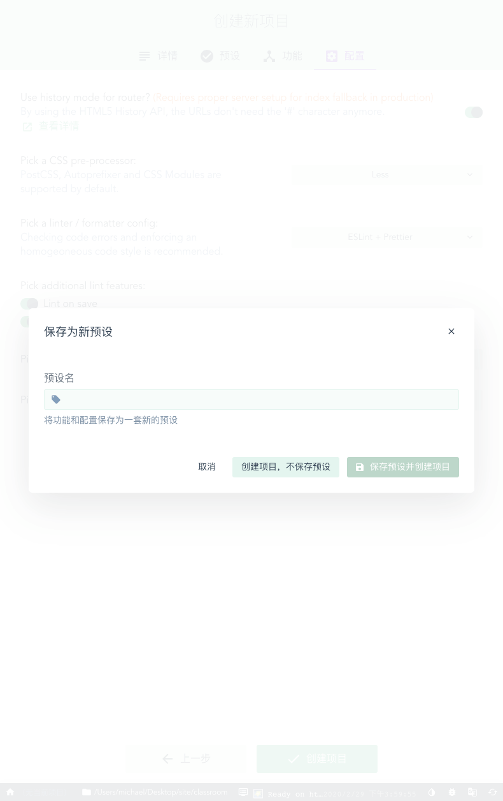
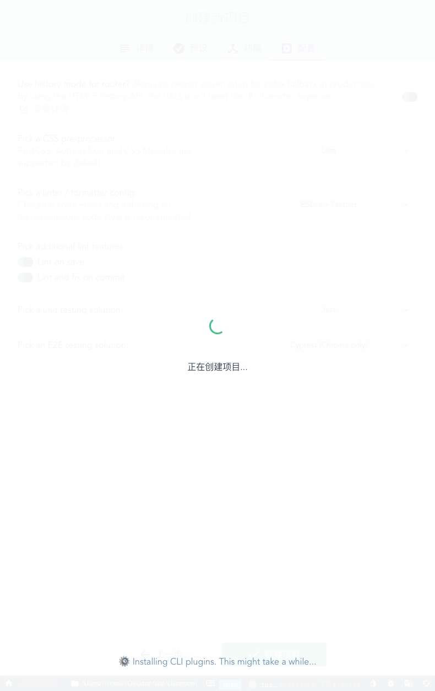  
</center>
<br />
<center class="half">
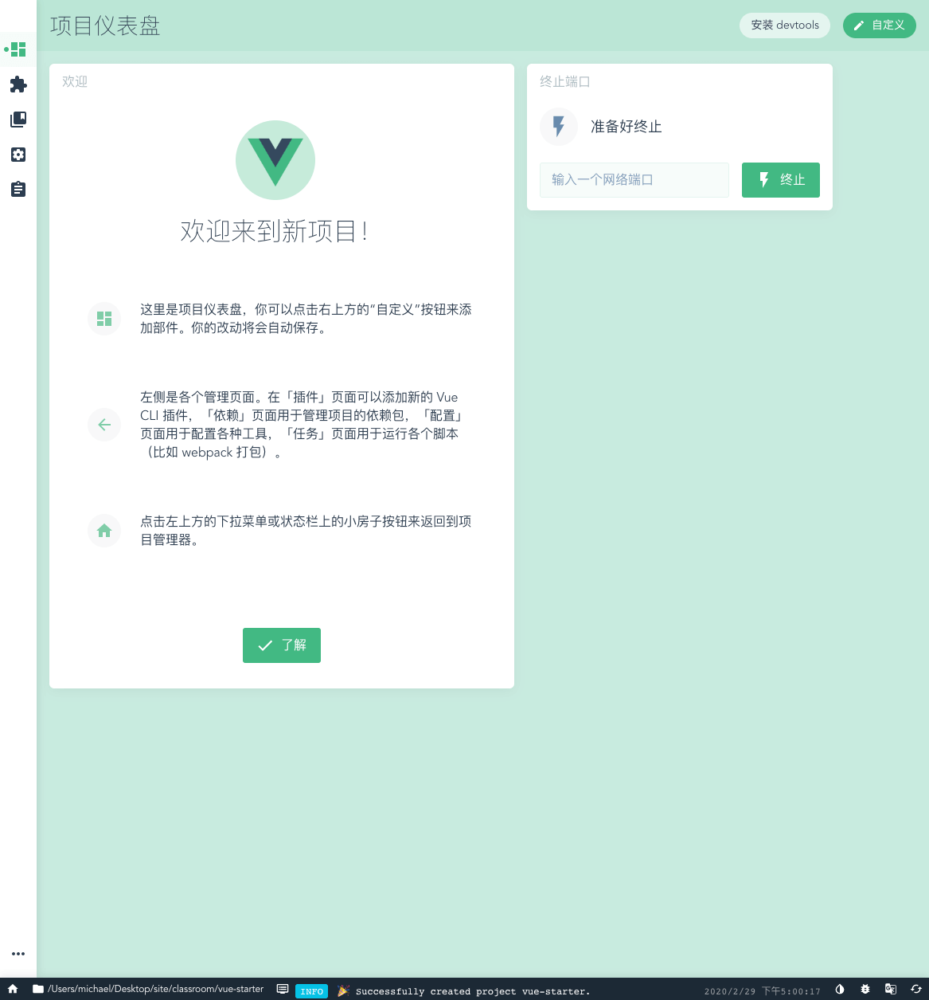
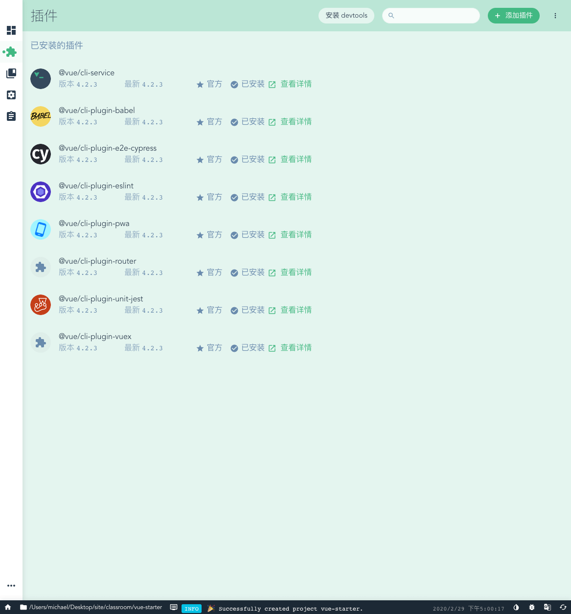
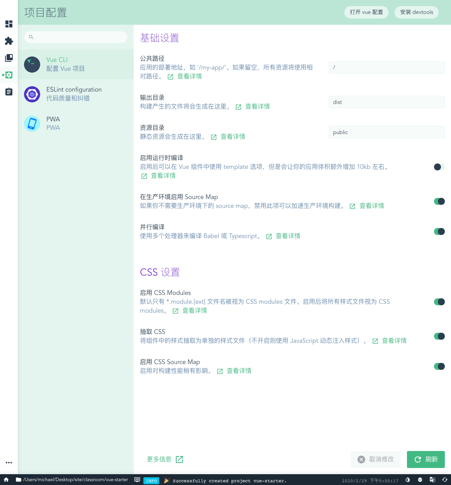
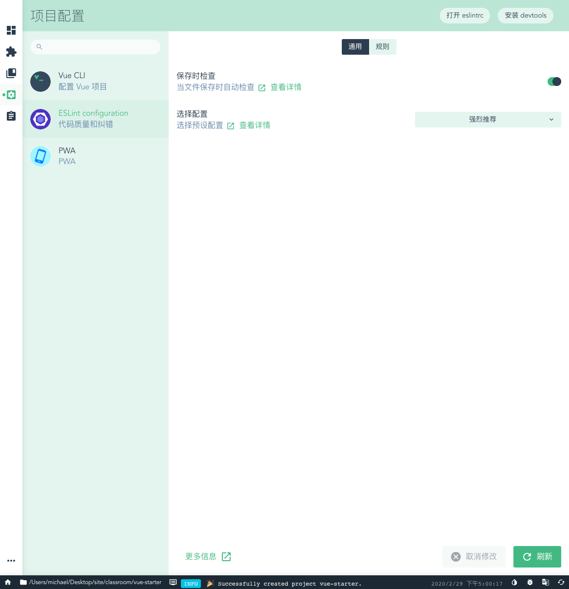
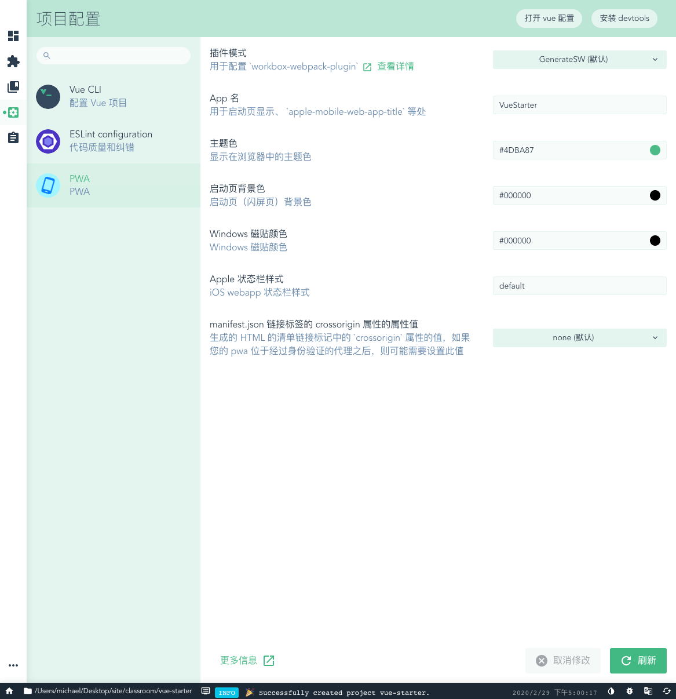
</center>

#### <a name="自定义配置">自定义配置</a>   
虽然使用 `vue ui` 可以进行可视化配置，但在实际开发中，如果有需要自定义配置的部分，可以参考[全局CLI配置](https://cli.vuejs.org/zh/config/#%E5%85%A8%E5%B1%80-cli-%E9%85%8D%E7%BD%AE)，本工程配置见 [`vue.config.js`](/vue.config.js)。  

`vue-cli-service` 暴露了 `inspect` 命令用于审查解析好的 `webpack` 配置，该命令会将解析出来的 `webpack` 配置、包括链式访问规则和插件的提示打印到 stdout，方法如下: 
```bash
# 参考：https://cli.vuejs.org/guide/webpack.html#inspecting-the-project-s-webpack-config
vue inspect > output.js 

# 只审查第一条规则
vue inspect module.rules.0

# 列出所有规则和插件的名字
vue inspect --rules
[
  'vue',
  'images',
  'svg',
  'media',
  'fonts',
  'pug',
  'css',
  'postcss',
  'scss',
  'sass',
  'less',
  'stylus',
  'js',
  'eslint'
]

vue inspect --plugins
[
  'vue-loader',
  'define',
  'case-sensitive-paths',
  'friendly-errors',
  'html',
  'pwa',
  'preload',
  'prefetch',
  'cors',
  'copy'
]
```  